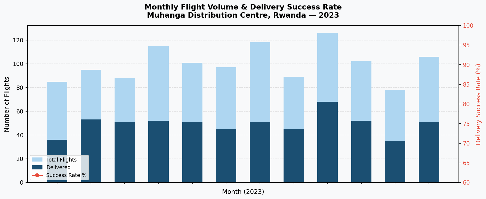
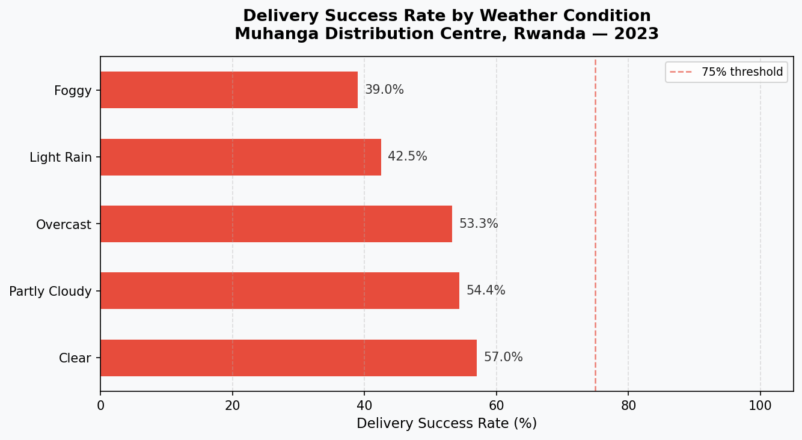
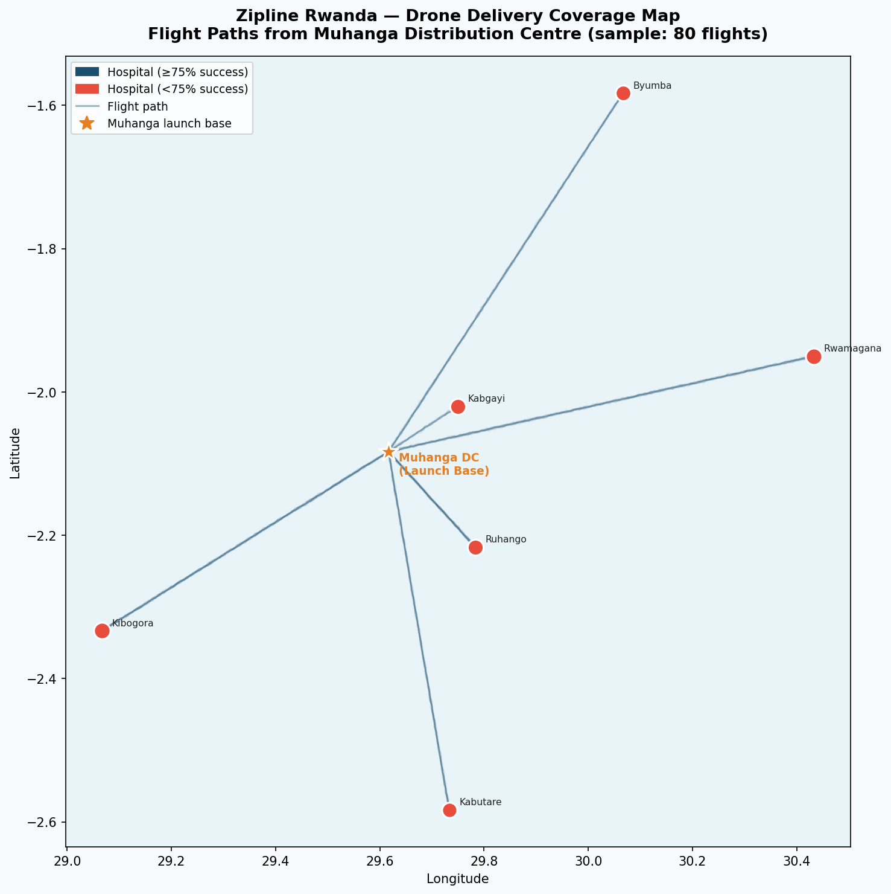
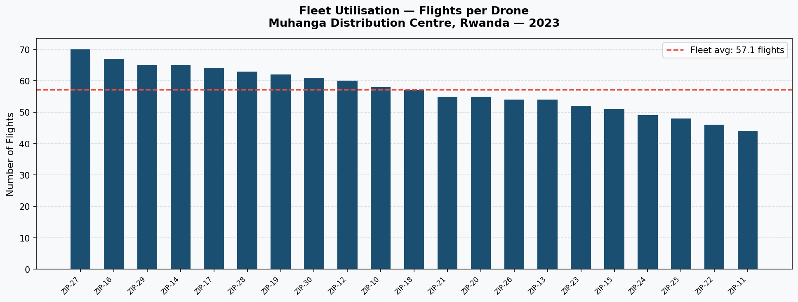

# Zipline Rwanda — Drone Delivery Operations Analysis

**Geospatial SQL and analytics pipeline project modelling Zipline Rwanda drone delivery operations.**

Built by Kevin Kayitare — Product Manager based in Kigali, Rwanda, working on Rwanda's nationwide Blood Bank Management System, civil registration, and health records infrastructure

---

## Background

Zipline's Rwanda network delivers blood products and medical supplies to hospitals across the Southern and Eastern provinces. This project simulates a full operational analytics pipeline modelled on that network — covering data ingestion, quality validation, SQL analysis, and visualisation.
The dataset is synthetic but grounded in Zipline's actual operating context: the Muhanga distribution centre, the hospitals it serves, blood product payloads, and the telemetry data drones produce in flight.
---

## Project structure

```
zipline-rwanda-analysis/
│
├── data/
│   ├── generate_data.py          # Generates synthetic flight datasets
│   ├── flights_summary.csv       # 1,200 flights: launch time, outcome, weather, battery, payload
│   └── flight_telemetry.csv      # 16,273 telemetry points: lat/lon/altitude/speed per flight
│
├── sql/
│   └── analysis_queries.sql      # 15 SQL queries across 5 operational categories
│
├── pipeline/
│   ├── load_and_validate.py      # Loads CSVs → SQLite, runs QA checks, outputs report
│   └── qa_report.txt             # Auto-generated data quality report
│
├── visualizations/
│   ├── generate_charts.py        # Generates 4 operational charts
│   ├── 01_monthly_volume_success.png
│   ├── 02_success_by_weather.png
│   ├── 03_coverage_map.png
│   └── 04_fleet_utilisation.png
│
└── zipline_rwanda.db             # SQLite database (auto-created by pipeline)
```

---

## Quickstart

```bash
# 1. Clone the repo
git clone https://github.com/Bpetal8/zipline-rwanda-analysis
cd zipline-rwanda-analysis

# 2. Install dependencies (Python 3.8+ required)
pip install pandas numpy matplotlib

# 3. Generate the dataset
python data/generate_data.py

# 4. Run the pipeline + QA validation
python pipeline/load_and_validate.py

# 5. Generate visualizations
python visualizations/generate_charts.py
```

No external database required — everything runs on SQLite (built into Python).

---

## What the pipeline does

### 1. Data ingestion
Loads two CSV sources into a SQLite database:
- `flights_summary` — operational metadata per flight
- `flight_telemetry` — time-series position/speed/altitude data

### 2. Data quality checks (9 automated checks)

| Check | Type |
|---|---|
| Null / missing fields audit | Completeness |
| Duplicate flight IDs | Integrity |
| Impossible durations (too fast for distance) | Physical validity |
| Battery critical landings (<20% remaining) | Safety flag |
| Delivery outcome breakdown | Informational |
| Success rate by weather condition | Operational |
| Coverage per destination hospital | Geospatial |
| Telemetry completeness | Coverage |
| Speed anomalies in telemetry (>35 m/s) | Anomaly detection |

### 3. QA report
Every pipeline run outputs a human-readable `qa_report.txt` with pass/fail status per check and full result tables.

---

## SQL analysis (5 categories, 15 queries)

**Section 1 — Data quality:** null audits, physical impossibility flags, duplicate detection, battery anomalies

**Section 2 — Delivery performance:** outcome breakdown, monthly trends, weather impact, efficiency ratios by district

**Section 3 — Coverage analysis:** flights per hospital, blood product distribution by district, failure rate heatmap

**Section 4 — Fleet & battery health:** drone utilisation, battery cycle tracking, peak operating hours

**Section 5 — Telemetry quality:** coverage gaps, step-jump detection, speed anomaly flagging, data completeness per flight

---

## Key Findings

Derived from the synthetic dataset generated for this project.


- Adverse weather reduced delivery success rates by 18 percentage points
  compared to clear conditions (39% vs 57%)
- Huye district recorded both the lowest flight volume (167 flights) and
  one of the lowest success rates (47.3%), indicating an underserved area
- Workload is broadly distributed across the fleet — the top 3 drones
  account for only 16.8% of total flights, suggesting balanced utilisation
- No step-jump or speed anomalies were detected in the telemetry dataset,
  confirming clean positional data across all 16,273 records

---

## Visualizations

### Monthly flight volume & delivery success rate
Tracks operational throughput and reliability month-over-month across 2023.




### Delivery success rate by weather condition
Quantifies weather impact on delivery reliability — operationally relevant for flight planning and SLA design.




### Geospatial coverage map
Flight paths from Muhanga DC to destination hospitals across Rwanda's Southern and Eastern provinces. Hospital marker size = flight volume; colour = success rate.




### Fleet utilisation — flights per drone
Confirms broadly even workload distribution across the fleet, relevant for maintenance scheduling and capacity planning.


---

## Operational Questions This Project Addresses
- *Is our data clean enough to trust for decision-making?* → QA pipeline
- *Which hospitals are we under-serving?* → Coverage analysis
- *Does weather affect delivery reliability, and by how much?* → Weather success rate
- *Which drones need maintenance attention?* → Fleet utilisation + battery health
- *Are there gaps in our telemetry that would break downstream analytics?* → Telemetry completeness

---

## About

Kevin Kayitare — Product Manager, Kigali, Rwanda.
Working on government-facing platforms including Rwanda's nationwide Blood Bank Management System, civil registration, and health records infrastructure.

